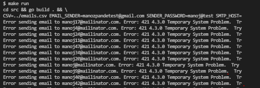

#### Email App
First list all the email that you want to send email for and update .env with corrct data (this email will be used to send email to all listing emails in csv)

run `make run`
then the application will send the email to all valid email address. Also logs the success and error message while sending mail.

