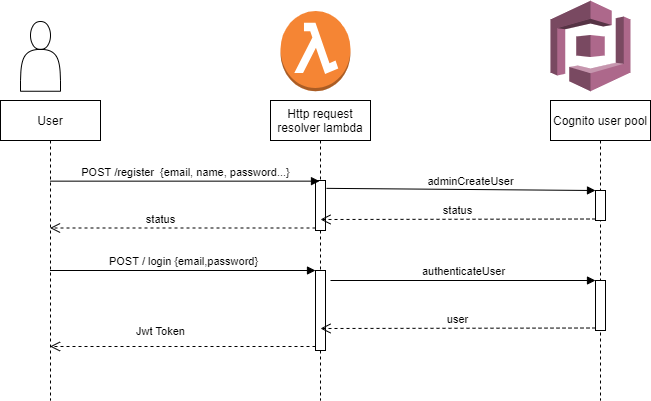

# System Architecture for AWS Login Module!

## Login Module

Before accessing any secured api, one needs to be authenticated.  AWS cognito allow us to easily sign up and sign in to our mobile and web apps. User signs in through user pool and receives user pool tokens after successful authentication. These tokens are user for AWS credentials through identity Pool.

AWS lambda is a serverless computing platform that runs code in response to events. To access the apis and servers in lambda, one need to have credentials from user cognito. This makes the resources more secure.

